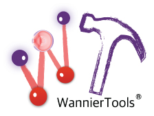

# WannierTools [](https://travis-ci.org/quanshengwu/wannier_tools)  [](https://codecov.io/gh/quanshengwu/wannier_tools)



The homepage of the WannierTools code is [**https://www.wanniertools.org**](https://www.wanniertools.org)

Full documentation of WannierTools is on website [**http://www.wanniertools.com**](http://quanshengwu.github.io/wannier_tools/)

QQ group number : 709225749


**Authors and contributors**
-------------
WannierTools was initialized by QuanSheng Wu (IOP CAS) and Shengnan Zhang (IOP CAS) at IOP CAS Beijing in 2012. 
Now, it's an open-source software, there are serveral contributors including

* Changming Yue (SusTech) : symmetrization of Wannier tight-binding Hamiltonian and obtain phonon tight-binding Hamiltonian.
* Yifei Guan (EPFL CH) : Landau level calculation.
* Tiantian Zhang (Tokyo Institute of Technology ): LOTO correction in phonon systems.
* Yi Liu (BNU Beijing) : Ruge-Kutta integration.
* Jianzhou Zhao (SWUST): QPI in kpath mode.
* Hanqi Pi (IOP CAS) : Anomalous Nerest Effects.

**Pull down the package**
-------------------------

The developing branch can be fetched by

```
git clone https://github.com/quanshengwu/wannier_tools.git
```

The stable branch can be downloaded in

[**https://github.com/quanshengwu/wannier\_tools/releases**](https://github.com/quanshengwu/wannier_tools/releases)


**Brief introductions**
-------------------------
We present an open-source software package WannierTools, a software for investigation of novel topological materials. 
This code works in the tight-binding framework, which can be generated by another software package Wannier90. 
It can help to classify the topological phase of a given materials by calculating the Wilson loop, 
and can get the surface state spectrum which is detected by angle resolved photoemission (ARPES) and in 
scanning tunneling microscopy (STM) experiments . It also identifies positions of Weyl/Dirac points and nodal line structures, 
calculates the Berry phase around a closed momentum loop and Berry curvature in a part of the Brillouin zone(BZ). 
Besides, WannierTools also can calculate ordinary magnetoresistance for non-magnetic metal and semimetal 
using Boltzmann transport theory, calculate Landau level spectrum with given magnetic field direction and strength, 
and get unfolded energy spectrum from a supercell calculation.

**License and Citation**
-------------------------
WannierTools was released under GPL V3. If you use our code for your research, please cite it properly, 
like  “ The surface spectrums or Berry curvature, Wilson loop, Weyl/Dirac points, Nodal line,  Chirality et al.
are calculated by the software package WannierTools~\cite{Wu2018}. "

Please use **WannierTools** instead of "wannier_tools" , "wannier-tools" or WannierTool" when you cite our software.

For the surface state calculation, please also cite {Sancho1985}. 

For the Wilson loop calculation, please also cite PhysRevB.84.075119 and PhysRevB.83.035108.

For magnetoresistance calculation, please also cite Magnetoresistance from Fermi surface topology, ShengNan Zhang, QuanSheng Wu, Yi Liu, and Oleg V. Yazyev, Phys. Rev. B 99, 035142 (2019)

For non-magnetic symmetrization processing, please cite "wannhr_symm: A tool for symmetrization of non-magnetic WannierTB, https://github.com/quanshengwu/wannier\_tools/tree/master/utility/wannhr_symm/, Changming Yue".

For magnetic symmetrization processing, please cite "wannhr_symm_Mag: A tool for symmetrization of magnetic WannierTB, https://github.com/quanshengwu/wannier\_tools/tree/master/utility/wannhr_symm_Mag, Changming Yue".

For phonon system calculation, please cite "PhonopyTB: a tool to construct tight-binding model for phonon systems, https://github.com/quanshengwu/wannier\_tools/tree/master/utility/phonopyTB, Changming Yue". 

Reference 

```
@article{WU2018,
title = "WannierTools : An open-source software package for novel topological materials",
journal = "Computer Physics Communications",
volume = "224",
pages = "405 - 416",
year = "2018",
doi = "https://doi.org/10.1016/j.cpc.2017.09.033",
url = "http://www.sciencedirect.com/science/article/pii/S0010465517303442",
issn = "0010-4655",
preprint = "arXiv:1703.07789",
author = "QuanSheng Wu and ShengNan Zhang and Hai-Feng Song and Matthias Troyer and Alexey A. Soluyanov",
keywords = "Novel topological materials, Topological number, Surface state, Tight-binding model"
}
```

Sancho1985: [Highly convergent schemes for the calculation of bulk and surface Green functions, M P Lopez Sancho, J M Lopez Sancho, J M L Sancho and J Rubio, J.Phys.F.Met.Phys.15(1985)851-858](http://iopscience.iop.org/article/10.1088/0305-4608/15/4/009/meta;jsessionid=A349A81FE38B2B55DB42032F6792B275.c1)

**Citations**
----------------

[Full list of citations from the ADS Databases](http://adsabs.harvard.edu/abs/2018CoPhC.224..405W/citations)

* Non-Abelian band topology in noninteracting metals, **QuanSheng Wu**, Alexey A. Soluyanov, and Tomas Bzdusek, Science 365, 1273 (2019)
* Phonon-Induced Topological Transition to a Type-II Weyl Semimetal, Lin-Lin Wang, Na Hyun Jo, Yun Wu, QuanSheng Wu, Adam Kaminski, Paul C. Canfield, Duane D. Johnson, [arXiv:1703.07292] (https://128.84.21.199/abs/1703.07292)
* Unique topological surface states of full-Heusler topological crystalline insulators, Anh Pham and Sean Li, [Phys. Rev. B 95, 115124 (2017)](https://journals.aps.org/prb/abstract/10.1103/PhysRevB.95.115124)
* Saddle-like topological surface states on the TT'X family of compounds (T, T' = Transition metal, X= Si, Ge) Bahadur Singh, Xiaoting Zhou, Hsin Lin, Arun Bansil, [arXiv:1703.04048] (https://arxiv.org/abs/1703.04048)
* Hidden Weyl points in centrosymmetric paramagnetic metals, Dominik Gresch, **QuanSheng Wu**, Georg W Winkler and Alexey A Soluyanov, [New J. Phys. 19 (2017) 035001](https://doi.org/10.1088/1367-2630/aa5de7)
* Topological semimetal to insulator quantum phase transition in the Zintl compounds Ba2X(X=Si,Ge), Ziming Zhu, Mingda Li, and Ju Li, [Phys. Rev. B 94, 155121](http://journals.aps.org/prb/abstract/10.1103/PhysRevB.94.155121), (2016)
* Heavy Weyl fermion state in CeRu4Sn6, Yuanfeng Xu, Changming Yue, Hongming Weng, Xi Dai, [arXiv:1608.04602](http://arxiv.org/abs/1608.04602),Phys. Rev. X 7, 011027 (2017) 
* Triple Point Topological Metals Ziming Zhu, Georg W. Winkler, **QuanSheng Wu**, Ju Li, Alexey A. Soluyanov  [arXiv:1605.04653](http://arxiv.org/abs/1605.04653) Phys. Rev. X 6, 031003 – Published 7 July 2016.
* Fermi arcs and their topological character in the candidate type-II Weyl semimetal MoTe2, A. Tamai, **Q. S. Wu**, I. Cucchi, F. Y. Bruno, S. Ricco, T.K. Kim, M. Hoesch, C. Barreteau, E. Giannini, C. Bernard, A. A. Soluyanov, F. Baumberger  [arXiv:1604.08228](http://arxiv.org/abs/1604.08228)   [Phys. Rev. X 6, 031021 (2016)](http://journals.aps.org/prx/abstract/10.1103/PhysRevX.6.031021)
* Nodal-chain metals, Tomáš Bzdušek, **QuanSheng Wu**, Andreas Rüegg, Manfred Sigrist, Alexey A. Soluyanov [arXiv:1604.03112, 2016 ](https://arxiv.org/abs/1604.03112) [Nature (2016) doi:10.1038/nature19099](http://www.nature.com/nature/journal/vaop/ncurrent/full/nature19099.html).
* Surface states and bulk electronic structure in the candidate type-II Weyl semimetal WTe2, F. Y. Bruno, A. Tamai, **Q. S. Wu**, I. Cucchi, C. Barreteau, A. de la Torre, S. McKeown Walker, S. Riccò, Z. Wang, T. K. Kim, M. Hoesch, M. Shi, N. C. Plumb, E. Giannini, A. A. Soluyanov, F. Baumberger [arXiv:1604.02411, 2016](https://arxiv.org/abs/1604.02411)
* Topological Phases in InAs1−xSbx: From Novel Topological Semimetal to Majorana Wire, Georg W. Winkler, **QuanSheng Wu**, Matthias Troyer, Peter Krogstrup, Alexey A. Soluyanov [arxiv:1602.07001, 2016](https://arxiv.org/abs/1602.07001)
* Type-II Weyl semimetals, Alexey A. Soluyanov,	Dominik Gresch,	Zhijun Wang,	**QuanSheng Wu**,	Matthias Troyer,	Xi Dai	& B. Andrei Bernevig, [Nature 527, 495–498 (26 November 2015)](http://www.nature.com/nature/journal/v527/n7579/full/nature15768.html) 
* Topologically nontrivial electronic states in CaSn3
Sunny Gupta, Rinkle Juneja,  Ravindra Shinde, and  Abhishek K. Singha)
Journal of Applied Physics 121, 214901 (2017); http://dx.doi.org/10.1063/1.4984262
* Transition between strong and weak topological insulator in ZrTe5 and HfTe5
Zongjian Fan , Qi-Feng Liang , Y. B. Chen, Shu-Hua Yao & Jian Zhou
http://www.nature.com/articles/srep45667
* Hidden Weyl points in centrosymmetric paramagnetic metals
Dominik Gresch1,3, QuanSheng Wu1, Georg W Winkler1 and Alexey A Soluyanov1,2
http://iopscience.iop.org/article/10.1088/1367-2630/aa5de7

* New Group V Elemental Bilayers: A Tunable Structure Model with 4,6,8-atom Rings
Xiangru Kong, Linyang Li, Ortwin Leenaerts, Xiong-jun Liu, François M. Peeters
https://arxiv.org/abs/1703.03550
* Hybrid Dirac Semimetal in CaAgBi Materials Family
Cong Chen, Shan-Shan Wang, Lei Liu, Zhi-Ming Yu, Xian-Lei Sheng, Ziyu Chen, Shengyuan A. Yang
https://arxiv.org/abs/1706.03915
* Multiple types of topological fermions in transition metal silicides
Peizhe Tang, Quan Zhou, Shou-Cheng Zhang
https://arxiv.org/abs/1706.03817

* Novel Spin-Orbit Dirac Point in Monolayer HfGeTe  
Shan Guan, Ying Liu, Zhi-Ming Yu, Shan-Shan Wang, Yugui Yao, Shengyuan A. Yang
https://arxiv.org/abs/1706.08692
* Quantum anomalous Hall effect in stable 1T-YN2 monolayer with a large nontrivial band gap and high Chern number 
Xiangru Kong, Linyang Li, Ortwin Leenaerts, Weiyang Wang, Xiong-Jun Liu, François M. Peeters
https://arxiv.org/abs/1707.01841
* Extremely large magnetoresistance and Kohler's rule in PdSn4: a complete study of thermodynamic, transport and band structure properties
Na Hyun Jo, Yun Wu, Lin-Lin Wang, Peter P. Orth, Savannah S. Downing, Soham Manni, Dixiang Mou, Duane D. Johnson, Adam Kaminski, Sergey L. Bud'ko, Paul C. Canfield
https://arxiv.org/abs/1707.05706
* https://journals.aps.org/prb/abstract/10.1103/PhysRevB.96.024106
Ternary Weyl semimetal NbIrTe4 proposed from first-principles calculation
Lei Li, Huan-Huan Xie, Jing-Sheng Zhao, Xiao-Xiong Liu, Jian-Bo Deng, Xian-Ru Hu, and Xiao-Ma TaoPhys. Rev. B 96, 024106 – Published 18 July 2017
* A new strongly topological node-line semimetal β-PbO2
Zhenwei Wang and Guangtao Wang
https://doi.org/10.1016/j.physleta.2017.06.041
* Robust Large Gap Quantum Spin Hall Insulators in Methyl-functionalized III-Bi Buckled Honeycombs
Qing Lu, Busheng Wang, Xiang-Rong Chen, Wu-Ming Liu
https://arxiv.org/abs/1707.07120
* Ferromagnetic Type-II Weyl Semimetal in Pyrite Chromium Dioxide
R. Wang, Y. J. Jin, J. Z. Zhao, Z. J. Chen, Y. J. Zhao, H. Xu
https://arxiv.org/abs/1707.08899v1
* Robustness of topological states with respect to lattice instability in the nonsymmorphic topological insulator KHgSb
* Chen, T.-T. Zhang, C.-J. Yi, Z.-D. Song, W.-L. Zhang, T. Zhang, Y.-G. Shi, H.-M. Weng, Z. Fang, P. Richard, and H. Ding
Phys. Rev. B 96, 064102 – Published 4 August 2017
https://doi.org/10.1103/PhysRevB.96.064102
* Two-dimensional Hexagonal M3C2 (M = Zn, Cd, Hg) Monolayer: Novel Quantum Spin Hall Insulators and Dirac Cone Materials
Peng-Fei Liu , Liujiang Zhou , Sergei Tretiak and Li-Ming Wu
DOI: 10.1039/C7TC02739G (Paper) J. Mater. Chem. C, 2017, Accepted Manuscript
* Topological Type-II Nodal Line Semimetal and Dirac Semimetal Statein Stable Kagome Compound Mg3Bi2
Xiaoming Zhang, Lei Jin, Xuefang Dai, and Guodong Liu,
School of Materials Science and Engineering, Hebei University of Technology, Tianjin 300130, China
http://pubs.acs.org/doi/pdf/10.1021/acs.jpclett.7b02129
* A nonmagnetic topological Weyl semimetal in quaternary Heusler compound CrAlTiV
Xiaoxiong Liu, Lei Li, Yvgui Cui, Jianbo Deng, and Xiaoma Tao
http://dx.doi.org/10.1063/1.4986155
 Appl. Phys. Lett. 111, 122104 (2017)

