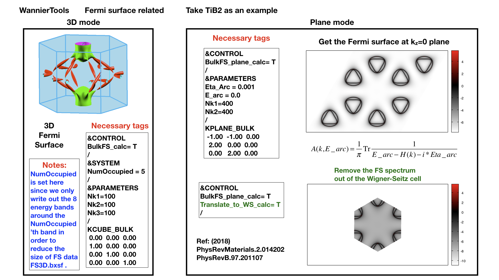
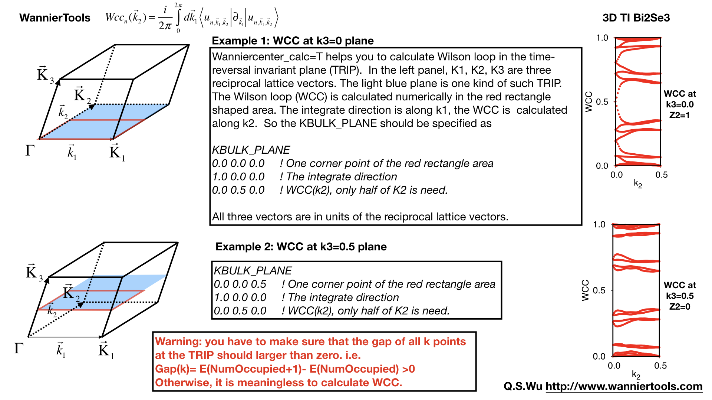

Capabilities of WannierTools
============================

-  :ref:`bulkbandcalculation`
-  :ref:`bulkfscalculation`
-  :ref:`bulkfsplanecalculation`
-  :ref:`doscalculation`
-  :ref:`findnodescalculation`
-  :ref:`energygapcalculation`
-  :ref:`slabbandcalculation`
-  :ref:`ribbonbandcalculation`
-  :ref:`sscalculation`
-  :ref:`ssqpicalculation`
-  :ref:`fermiarccalculation`
-  :ref:`spintexturecalculation`
-  :ref:`berryphasecalculation`
-  :ref:`berrycurvcalculation`
-  :ref:`ahccalculation`
-  :ref:`wanniercentercalculation`
-  :ref:`z2bulkcalculation`
-  :ref:`chernbulkcalculation`
-  :ref:`weylchiralitycalculation`
-  :ref:`landaulevel`

.. _bulkbandcalculation:

Bulk band calculation (points mode, line mode and plane mode)
^^^^^^^^^^^^^^^^^^^^^^^^^^^^^^^^^^^^^^^^^^^^^^^^^^^^^^^^^^^^^^^^^^^

Points mode
--------------
You can calculate the energy bands with the given k points in the KPOINTS_3D :ref:`kpoints3d` card.

Input
>>>>>
Typical flags for this mode in the wt.in. ::

  &CONTROL
  BulkBand_points_calc = T
  /
  
  KPOINTS_3D            
  4              ! number of k points
  Direct         ! Direct or Cartesian
  0.00000 0.00000 0.0000  
  0.00000 0.00000 0.5000
  0.50000 0.50000 0.0000
  0.00000 0.00000 0.0000

Output
>>>>>>

The outputs for this mode is **bulkek-pointsmode.dat**

Line mode
------------

Calculate bulk energy band for a series k lines. This is the basic calculation after the
construction of Wannier functions. You have to compare your Wannier interpolated bands 
with the DFT bands. Those two bands should match well around the Fermi level.

.. _bulkekin:

Input
>>>>>
Typical flags for bulk band calculation in the wt.in. ::

  &CONTROL
  BulkBand_calc = T
  /
  &PARAMETERS
  Nk1 = 101   ! Number of k points for each k line
  /

  KPATH_BULK     ! k point path
  4              ! number of k lines only for bulk band
  G 0.00000 0.00000 0.0000 Z 0.00000 0.00000 0.5000
  Z 0.00000 0.00000 0.5000 F 0.50000 0.50000 0.0000
  F 0.50000 0.50000 0.0000 G 0.00000 0.00000 0.0000
  G 0.00000 0.00000 0.0000 L 0.50000 0.00000 0.0000  

See :ref:`controlnamelist`, :ref:`parametersnamelist`, :ref:`kpathbulk`

.. _bulkekout:

Output
>>>>>>

The outputs for bulk band calculation are **bulkek.dat** and **bulkek.gnu**. You can get the band plot by running ::

  gnuplot bulkek.gnu

or ::

 xmgrace bulkek.dat

to get bandstucture plot.  

The data structure for **bulkek.dat** ::

    0.000000000       -2.673821992  119   80   80  119   80   80  205  138  138   70   40   40   70   40   40    0    0    0    0    0    0    0    0    0    0    0    0    0    0    0
    0.016453872       -2.681536808  118   78   78  118   78   78  203  134  134   82   41   41   82   41   41    0    0    0    0    0    0    0    0    0    0    0    0    0    0    0

1. The 1st column represents k points for the given kpath (KPATH_BULK)
2. The 2nd column is the energy level 
3. From the 3rd to the n'th column are the projected weight of the wave
   function at each k point and each band onto
   each wannier orbitals. Those weights are normalized 
   to 255 for the color plot convinence.

The subrotine for this feature is ek_bulk.f90 .

Plane mode
--------------

Calculate band structure in a k slice(plane) specified by KPLANE_BULK card.
The mode is very useful to visualize the Dirac/Weyl cone. You have to set the following tags in **wt.in** ::

  &CONTROL
  BulkBand_plane_calc = T
  /
  &PARAMETERS
  Nk1 = 51   ! Number of k points along the first vector in KPLANE_BULK
  Nk2 = 51   ! Number of k points along the second vector in KPLANE_BULK
  /

  KPLANE_BULK   ! fractional coordinates
   0.00  0.00  0.30   ! Middle point for a k slice(plane) in 3D BZ. Usually, the position of Dirac points.
   0.50  0.00  0.00   ! The first vector to define k plane(slice) in 3D BZ
   0.00  0.50  0.00   ! The second vector to define k plane(slice) in 3D BZ

The output file is **bulkek_plane.dat**, **bulkek_plane-matlab.dat** and **bulkek_plane.gnu**. You can get 
**bulkek_plane.png** with ::

   gnuplot bulkek_plane.gnu

The **bulkek_plane-matlab.dat** is in MATLAB data format. You can plot the Dirac cone with matlab.  

The format of **bulkek_plane.dat** is as follows::

               # kx                 ky                 kz                 k1                 k2                 k3   E(Numoccupied-1)     E(Numoccupied)   E(Numoccupied+1)   E(Numoccupied+2)
       -0.299354337       -0.518496963        0.180167841       -0.518496936       -0.299354384        0.180167841       -1.311721381       -1.311705191        0.588683811        0.588872215
       -0.299354337       -0.504670376        0.180167841       -0.511583643       -0.287380208        0.180167841       -1.294078082       -1.293904952        0.586780093        0.587249790
       ...

Column 1-3rd are k points in cartesian coordinates. Column 4-6th are k points in a rotated cartesian coordinates 
where the x and y direction are line in the k plane and the z direction is perpendicular to the k plane you specified. 
Column 7-10th are energies at each k point. Here we only print out 4 energy bands around the fermilevel. It depends on **NumOccupied**.
Usually, I choose column 4th and 5th as k coordinates and choose 8 and 9 as energy bands to show the Dirac cone shown below.

.. image:: bulkek_plane.png
   :scale: 15 %

.. _bulkfscalculation:

BulkFS calculation
^^^^^^^^^^^^^^^^^^^^^^
Bulk Fermi surface calculation. 

Input
-------

You should specify the number of k points for each three reciprocal vectors Nk1, Nk2, Nk3 
in NAMELISTS PARAMETERS ::

  &CONTROL
  BulkFS_calc = T
  /
  &PARAMETERS
  Nk1 = 101   ! No. of slices for the 1st reciprocal vector
  Nk2 = 101   ! No. of slices for the 2nd reciprocal vector
  Nk3 = 101   ! No. of slices for the 3rd reciprocal vector
  /
      
  KCUBE_BULK
    0.00  0.00  0.00   ! Original point for 3D k plane 
    1.00  0.00  0.00   ! The first vector to define 3d k space plane
    0.00  1.00  0.00   ! The second vector to define 3d k space plane
    0.00  0.00  1.00   ! The third vector to define 3d k cube
 
See :ref:`controlnamelist`, :ref:`parametersnamelist`

Output
---------

The outputs for this function are **FS3D.bxsf**. 
You can plot the FS with `xcrysden <http://www.xcrysden.org>`_  run ::

   xcrysden --bxsf FS3D.bxsf

to get the plot. 

By the way, Bulk band and BulkFS calculations were already implemented in Wannier90 code.

.. _bulkfsplanecalculation:

BulkFS plane calculation
^^^^^^^^^^^^^^^^^^^^^^^^^^^^^^

Bulk Fermi surface in a fixed k plane specified by KPLANE_BULK 

Input
--------

You should specify the number of k points for each three reciprocal vectors Nk1, Nk2
in NAMELISTS PARAMETERS ::

  &CONTROL
  BulkFS_Plane_calc = T
  /
  &PARAMETERS
  Nk1 = 101   ! No. of slices for the 1st reciprocal vector
  Nk2 = 101   ! No. of slices for the 2nd reciprocal vector
  /
      
  KPLANE_BULK  ! in fractional coordinates
    0.00  0.00  0.00   ! Original point for 3D k plane 
    1.00  0.00  0.00   ! The first vector to define 3d k space plane
    0.00  1.00  0.00   ! The second vector to define 3d k space plane
 
See :ref:`controlnamelist`, :ref:`parametersnamelist`

Output
---------

The outputs for this function are **fs.gnu, fs.png**. 

   gnuplot fs.gnu

to get the plot. 

.. _doscalculation:

Density state(DOS) calculations
^^^^^^^^^^^^^^^^^^^^^^^^^^^^^^^^^^^^

Calculation density of state for the bulk system. The typical setup in **wt.in**::

  &CONTROL
  DOS_calc = T
  /
  &PARAMETERS
  OmegaNum = 601    ! number of slices of energy
  OmegaMin = -1.0   ! erergy range for DOS
  OmegaMax =  1.0
  Nk1 = 51   ! No. of slices for the 1st reciprocal vector
  Nk2 = 51   ! No. of slices for the 2nd reciprocal vector
  Nk3 = 51   ! No. of slices for the 3nd reciprocal vector
  /
      
  KCUBE_BULK
    0.00  0.00  0.00   ! Original point for 3D k plane 
    1.00  0.00  0.00   ! The first vector to define 3d k space plane
    0.00  1.00  0.00   ! The second vector to define 3d k space plane
    0.00  0.00  1.00   ! The third vector to define 3d k cube
   
  
Outputs are **dos.dat** and **dos.gnu**. **dos.eps** will be obtained with ::

   gnuplot dos.gnu
   

.. _energygapcalculation:

Energy gap calculations (plane and cube mode)
^^^^^^^^^^^^^^^^^^^^^^^^^^^^^^^^^^^^^^^^^^^^^^^^^

We support two modes for energy gap calculations.The formula is 
:math:`gap(k)= E_{NumOccupied+1}(k)- E_{NumOccpuied}(k)`

Gap_plane mode
-----------------

Calculate the energy gap for the k points in the KPLANE_BULK. 
This is useful to show Weyl points and nodal line structure.

Input 
>>>>>>>>

Typical input parameters for BulkGap_plane calculation ::

  &CONTROL
  BulkGap_Plane_calc = T
  /
  &PARAMETERS
  Nk1 = 101   ! No. of slices for the 1st reciprocal vector
  Nk2 = 101   ! No. of slices for the 2nd reciprocal vector
  /

  KPLANE_BULK
   0.00  0.00  0.00   ! Original point for 3D k plane 
   1.00  0.00  0.00   ! The first vector to define 3d k space plane(slice)
   0.00  0.50  0.00   ! The second vector to define 3d k space plane(slice)

See :ref:`controlnamelist`, :ref:`parametersnamelist`, :ref:`kpathbulk`

Output
>>>>>>

The outputs for Gap_plane mode are **GapPlane.dat**, **GapPlane.gnu**. The **GapPlane.png** will get by ::
   
   gnuplot GapPlane.gnu

The head of **GapPlane.dat** ::

    kx              ky              kz             gap             Ev4             Ev3             Ev2             Ev1             Ec1             Ec2             Ec3             Ec4              k1              k2              k3
    0.00000000      0.00000000      0.00000000      0.45569845     -0.69109275     -0.69109055     -0.29654328     -0.29654073      0.15915772      0.15915871      1.24348171      1.24348457      0.00000000      0.00000000      0.00000000
    0.03796028     -0.02191637      0.00548462      0.43770730     -0.77636510     -0.77598312     -0.26035113     -0.26027881      0.17742849      0.17771545      1.29499437      1.29505298      0.00000000      0.02500000      0.00000000

* Column 1-3 are the Cartesian coordinates of the k points in the KPLANE_BULK, in unit of :math:`\frac{1}{Angstrom}`
* Column 4 is the energy gap
* Column 5-12 are the energy value for valence and conduction bands close to the Fermi level. There are
  4 conduction bands and 4 valence bands. 
* Column 13-15 are the Direct coordinates of the k points in the KPLANE_BULK

Gap_Cube mode
-----------------

This helps us to find Weyl points and nodal line structure in the 3D BZ. 

Input
>>>>>>

Typical input parameters for BulkGap_cube calculation ::

  &CONTROL
  BulkGap_Cube_calc = T
  /
  &PARAMETERS
  Nk1 = 101   ! No. of slices for the 1st reciprocal vector
  Nk2 = 101   ! No. of slices for the 2nd reciprocal vector
  Nk3 = 101   ! No. of slices for the 3rd reciprocal vector
  /

  KCUBE_BULK
  -0.50 -0.50 -0.50   ! Original point for 3D k plane 
   1.00  0.00  0.00   ! The 1st vector to define 3d k cube
   0.00  1.00  0.00   ! The 2nd vector to define 3d k cube
   0.00  0.00  1.00   ! The 3rd vector to define 3d k cube

See :ref:`controlnamelist`, :ref:`parametersnamelist`, :ref:`kcube_bulk`

Output
>>>>>>>

The outputs for Gap_plane mode are **GapCube.dat**, **GapCube.gnu**. The **GapCube.png** will get by ::
   
   gnuplot GapCube.gnu

The head of **GapCube.dat** are ::

   kx (1/A)        ky (1/A)        kz (1/A)      Energy gap              Ev              Ec      k1 (2pi/a)      k2 (2pi/b)      k3 (2pi/c)
   0.00000000      0.87665487     -0.54846229      0.79075142     -0.34827281      0.44247861     -0.50000000     -0.50000000     -0.50000000
   0.00000000      0.87665487     -0.51555455      0.86792416     -0.38635069      0.48157346     -0.50000000     -0.50000000     -0.45000000

* Column 1-3 are the Cartesian coordinates of the k points where energy gap is small than Gap_threshold, in unit of :math:`\frac{1}{Angstrom}`
* Column 4 is the energy gap. Those values are smaller than Gap_threshold, see :ref:`parametersnamelist`
* Column 5-6 are the energy value for valence and conduction bands close to the Fermi level. There are
  4 conduction bands and 4 valence bands. 
* Column 7-9 are the Direct coordinates of the k points.

.. _findnodescalculation:

Find Nodes calculation
^^^^^^^^^^^^^^^^^^^^^^^^^^^

Beside by using GapCube and GapPlane to find Weyl/Dirac nodes or node lines, we can directly
using FindNodes function. 
:math:`gap(k)= E_{NumOccupied+1}(k)- E_{NumOccpuied}(k)`

Input
--------

Typical input parameters for FindNodes_cube calculation ::

  &CONTROL
  FindNodes_calc = T
  /
  &PARAMETERS
  Nk1 = 8   ! No. of slices for the 1st reciprocal vector
  Nk2 = 8   ! No. of slices for the 2nd reciprocal vector
  Nk3 = 8   ! No. of slices for the 3rd reciprocal vector
  Gap_threshold = 0.0001 ! a value to determine which point should be identified as a node
  /

  KCUBE_BULK
  -0.50 -0.50 -0.50   ! Original point for 3D k plane 
   1.00  0.00  0.00   ! The 1st vector to define 3d k cube
   0.00  1.00  0.00   ! The 2nd vector to define 3d k cube
   0.00  0.00  1.00   ! The 3rd vector to define 3d k cube

.. NOTE::
   
   Please don't set Nk1, Nk2, Nk3 too large. Otherwise, it will become very time consuming. Usually, 15*15*15 is enough to get converged number of Weyl/Dirac points.

Output
---------
   
Outputs are **Nodes.dat** and **Nodes.gnu**. Nodes.png will be obtained by ::
   
   gnuplot Nodes.gnu

Here are heads of output for WTe2 **Nodes.dat** ::

   # local minimal position and the related energy gap
   #      kx          ky          kz         gap           E          k1          k2          k3
       0.219436   -0.045611   -0.000001    0.000000    0.056688    0.121432   -0.045363   -0.000003
      -0.219515   -0.045063   -0.000001    0.000000    0.056461   -0.121476   -0.044818   -0.000002
       0.220195   -0.038682   -0.000002    0.000000    0.051264    0.121852   -0.038472   -0.000003
      -0.220183   -0.038936   -0.000001    0.000000    0.051618   -0.121845   -0.038724   -0.000003
       0.219514    0.045063    0.000001    0.000000    0.056459    0.121475    0.044818    0.000003
      -0.219434    0.045620    0.000002    0.000000    0.056692   -0.121431    0.045371    0.000004
      -0.220194    0.038678    0.000000    0.000000    0.051259   -0.121851    0.038468    0.000001
       0.220181    0.038941    0.000000    0.000000    0.051620    0.121844    0.038729    0.000001

You will find that there are 8 Weyl points in the BZ as expected. 

.. _weylchiralitycalculation:

Weyl Chirality calculation
^^^^^^^^^^^^^^^^^^^^^^^^^^^^^^^

After you identify the positions of Weyl points, you could use this function to calculate the chirality, 
which tells you whether a Weyl point is a sink or a source of the Berry Curvature. 

Input
--------

Typical input parameters for WeylChirality_calc calculation ::

  &CONTROL
  WeylChirality_calc = T
  /
  &PARAMETERS
  Nk1 = 41   ! No. of slices for the 1st reciprocal vector, berry phase integration direction
  Nk2 = 21   ! No. of slices for the 2nd reciprocal vector
  /

  WEYL_CHIRALITY
  8            ! Num_Weyls  
  Cartesian    ! Direct or Cartesian coordinate
  0.004        ! Radius of the ball surround a Weyl point
   0.219436   -0.045611   -0.000000    ! Positions of Weyl points, No. of lines should larger than Num_weyls
  -0.219515   -0.045063   -0.000000   
   0.220195   -0.038682   -0.000000   
  -0.220183   -0.038936   -0.000000   
   0.219514    0.045063    0.000000   
  -0.219434    0.045620    0.000000   
  -0.220194    0.038678    0.000000   
   0.220181    0.038941    0.000000   

Output
---------
   
Outputs are **wanniercenter3D_Weyl.dat** and **wanniercenter3D_Weyl_i.gnu**. wanniercenter3D_Weyl.png will be obtained by ::
  
   gnuplot wanniercenter3D_Weyl_i.gnu 

   for ((i=1; i<9; i++)); do gnuplot wanniercenter3D_Weyl_$i.gnu;done

.. NOTE::

   i is an integer from 1 to Num_weyls

Here are heads of output for WTe2 **wanniercenter3D_Weyl.dat** ::

     # Chirality              -1               1               1              -1               1              -1               1              -1
            # k            phase           phase           phase           phase           phase           phase           phase           phase
      0.00000000      0.99970932      0.00005854      0.00004671      0.99975139      0.00005851      0.99970861      0.00004736      0.99975087
      0.05000000      0.89229069      0.08696587      0.08941971      0.90855415      0.08723118      0.89170870      0.09022452      0.90795187
      0.10000000      0.79659821      0.16589558      0.17112299      0.82248889      0.16697194      0.79511289      0.17279423      0.82108022

The first line shows the chiralities of each Weyl point. The first column is k point. From the 2nd to the last column 
show the Wannier charge center phase. In total, there are Num_weyls columns.

.. _slabbandcalculation:

Slab band calculation
^^^^^^^^^^^^^^^^^^^^^^^^^

Before using iterative green’s function to get the surface state spectrum for semi-infinite system. 
We also can just construct a finite thickness slab system and
calculate the band structure for it. 

.. NOTE::

 For slab calculations, please read carefully the input card :ref:`surface`

Input
--------

::
 
  &CONTROL
  SlabBand_calc = T
  /
  &SYSTEM
  NSLAB = 10 
  /
  &PARAMETERS
  Nk1 = 101   ! No. of slices for the 1st reciprocal vector
  /
  KPATH_SLAB
  2        ! numker of k line for 2D case
  K 0.33 0.67 G 0.0 0.0  ! k path for 2D case
  G 0.0 0.0 M 0.5 0.5

See :ref:`controlnamelist`, :ref:`systemnamelist` :ref:`parametersnamelist`, :ref:`kpathslab`

Output
---------

Outputs are **slabek.dat** and **slabek.gnu** 

The heads of **slabek.dat** are ::

    0.0000000     -4.9575466     240
    0.0508687     -5.0110528     226
    0.1017373     -5.0566963     221
    0.1526060     -5.0671994     220
    ...

* The 1st column are k points in the KPATH_SLAB
* The 2nd column are energy values.
* The 3rd column represent the surface weight, which is normalized to 255.

The colorfull plot **slabek.png** of the slab energy bands can be obtained by ::

   gnuplot slabek.gnu

.. _ribbonbandcalculation:

Nanowire/nanoribbon  band calculation
^^^^^^^^^^^^^^^^^^^^^^^^^^^^^^^^^^^^^^^

Band calculation for wire system. Only one direction is periodic, the other two directions are confined.

Input
-------

You don't have to set the k path, because it only has one direction. ::

  &CONTROL
  WireBand_calc = T
  /
  &SYSTEM
  NSLAB1 = 4  
  NSLAB2 = 4  
  /
  &PARAMETERS
  Nk1 = 101   ! No. of slices for the 1st reciprocal vector
  /

See :ref:`controlnamelist`, :ref:`systemnamelist` :ref:`parametersnamelist`

Output
---------

Outputs are **ribbonek.dat** and **ribbonek.gnu**. The data format of **ribbonek.dat** is the same as
**slabek.dat**. Get plot ribbonek.png with ::
   
   gnuplot ribbonek.gnu

.. _sscalculation:

Surface state ARPES calculation
^^^^^^^^^^^^^^^^^^^^^^^^^^^^^^^^^^

One important feature for topological materials is the surface state. The bulk-edge correspondence 
tells us, if the topological property of the bulk system is nontrivial, then there will be
nontrivial states on the surface. Nowadays, there are several method to detect the surface states. 
One direct way is the angle resolved photoemission spectroscopy (ARPES). Such spectrum can be 
obtained by the iterative Green's function. 

.. NOTE::

 For slab calculations, please read carefully the input card :ref:`surface`

Input
-------
::
 
  &CONTROL
  SlabSS_calc = T
  /
  &PARAMETERS
  OmegaNum = 101
  OmegaMin = -1.0
  OmegaMax =  1.0
  Nk1 = 101   ! No. of slices for the 1st reciprocal vector
  NP = 2      ! principle layer
  /
  KPATH_SLAB
  2        ! numker of k line for 2D case
  K 0.33 0.67 G 0.0 0.0  ! k path for 2D case
  G 0.0 0.0 M 0.5 0.5

See :ref:`controlnamelist`, :ref:`parametersnamelist`, :ref:`kpathslab`

NP : integer valued, Number of principle layers, see details related to iterative green’s function. 
Used if  SlabSS_calc= T, SlabArc_calc=T, SlabSpintexture_calc=T. Default value is 2. You need to do a convergence test by setting Np= 1, Np=2, Np=3, and check the surface state spectrum. Basically, the value of Np depends on the spread of Wannier functions you constructed. One thing should be mentioned is that the computational time grows cubically of Np. 

Output
---------

The output files are **surfdos_l.dat**, **surfdos_r.dat**, **surfdos_l.gnu**, **surfdos_r.gnu**. You could get the the spectral function
plots with ::
   
   gnuplot surfdos_l.gnu
   gnuplot surfdos_r.gnu

**_l** and **_r** means the top and bottom surface.

.. _ssqpicalculation:

Surface state QPI calculation
^^^^^^^^^^^^^^^^^^^^^^^^^^^^^^^^

Settings for this feature are almost the same as :ref:`fermiarccalculation`. Only difference is that 
you should set  ::

   &CONTROL
   SlabQPI_calc          = T
   /
   
Output
--------

There are a lot of outputs for QPI calculation. including 
 arc.dat_l, arc.dat_r,     
 arc_l.gnu, arc_r.gnu,     
 arc_l_only.gnu, arc_l_only.gnu,           
 arc.jdat_l, arc.jdat_r,   
 arc.jsdat_l, arc.jsdat_r, 
 arc_l_jdos.gnu, arc_l_jsdos.gnu,          
 arc_r_jdos.gnu, arc_r_jsdos.gnu. 

 The gnu script with 'only' means we only plot the spectrum with the surface contribution, exclude the 
 bulk contribution.  jdat_l is the QPI data without consideration of spin scattering. jsdat_l is the QPI data in consideration of spin scattering. 

.. _fermiarccalculation:

Fermi arc calculation
^^^^^^^^^^^^^^^^^^^^^^^^^
Surface state spectrum at fixed energy level E_arc set in NAMELISTS PARAMETERS . Set SlabArc_calc=T, 
and  set Nk1, Nk2, in NAMELISTS PARAMETERS, set k plane in KPLANE_SLAB CARD. 
Get the plots with  "gnuplot arc_l.gnu”, "gnuplot arc_r.gnu”. **_l** and **_r** means the top and bottom surface.

.. _spintexturecalculation:

Spin texture calculation
^^^^^^^^^^^^^^^^^^^^^^^^^^^^
Spin texture calculation at fixed energy level E_arc set in NAMELISTS PARAMETERS . 
Set Slabspintexture_calc=T, and  set Nk1, Nk2, in NAMELISTS PARAMETERS, set k plane in KPLANE_SLAB CARD. 
Get the plots with  "gnuplot spintext_l.gnu”, "gnuplot spintext_r.gnu”.

.. _berryphasecalculation:

Berry phase calculation
^^^^^^^^^^^^^^^^^^^^^^^^^^^^

Calculate Berry phase of a closed k path in 3D BZ. This is useful in a nodal line system. It is demonstrated that
the Berry phase around a closed mirror symmetric k loop is either 0 or pi for a mirror protect nodal line system. 

In WannierTools, you can specify a k path by a serials  k points. Here we take the WC example, which has two nodal lines around 
K point.

Input
^^^^^
::
 
  &CONTROL
  BerryPhase_calc = T
  /
  &SYSTEM
  NumOccupied = 10        ! Number of occupied Wannier orbitals
  /
  &PARAMETERS
  Nk1 = 21    ! No. of slices for the 1st reciprocal vector
  /

  KPATH_BERRY
  11
  Direct
   0.3    0.333  -0.2
   0.3    0.333  -0.1
   0.3    0.333  -0.0
   0.3    0.333   0.1
   0.3    0.333   0.2
   0.33   0.333   0.2
   0.33   0.333   0.1
   0.33   0.333   0.0
   0.33   0.333  -0.1
   0.33   0.333  -0.2
   0.3    0.333  -0.2

Output
------

The value of Berry phase can be found in the **WT.out**.

.. NOTE::
   
   1. In principlely, the Berry phase for around a nodal line should be interger. However,
   the MLWF-TB model usally is not symmetric. So the value of Berry phase is close to zero
   or one. 

   2. The first and the last kpoints in the KPATH_BERRY should be the same to form a loop.

.. _berrycurvcalculation:

Berry curvature calculation
^^^^^^^^^^^^^^^^^^^^^^^^^^^^^

Calculate Berry curvature at a fixed k plane in 3D BZ. Set BerryCurvature_calc=T, and  set Nk1, Nk2, in NAMELISTS PARAMETERS, set k plane in KPLANE_BULK CARD. Get the plot with  "gnuplot Berrycurvature.gnu”.

please set NumOccpuied correctly. It represents the “occpuied” wannier bands, not the total number of electrons. In this application, the Berrycurvature is the summation over NumOccupied bands. 

.. _ahccalculation:

Anomalous Hall conductivity (AHC)
^^^^^^^^^^^^^^^^^^^^^^^^^^^^^^^^^^^^^

Calculate AHC in the energy range [OmegaMin, OmegaMax]. AHC is in unit of (Ohm*cm)^-1.

Relevant inputs are ::

   &CONTROL
   AHC_calc=T 
   /

   &PARAMETERS
   OmegaNum = 601    ! number of slices of energy
   OmegaMin = -1.0   ! erergy range for AHC
   OmegaMax =  1.0
   Nk1 = 51   ! No. of slices for the 1st reciprocal vector
   Nk2 = 51   ! No. of slices for the 2nd reciprocal vector
   Nk3 = 51   ! No. of slices for the 3nd reciprocal vector
   /

   KCUBE_BULK
     0.00  0.00  0.00   ! Original point for 3D k plane 
     1.00  0.00  0.00   ! The first vector to define 3d k space plane
     0.00  1.00  0.00   ! The second vector to define 3d k space plane
     0.00  0.00  1.00   ! The third vector to define 3d k cube
 

Output is **sigma_ahe.txt**.

.. _wanniercentercalculation:

Wannier charge center/Wilson loop calculation
^^^^^^^^^^^^^^^^^^^^^^^^^^^^^^^^^^^^^^^^^^^^^^^^^

Wannier charge center, which is sometimes called Wilson loop can be calculated by set WannierCenter_calc=T and set KPLANE_BULK CARD,  set number of k points for two vectors is Nk1, Nk2 in NAMELISTS PARAMETERS.  Notice: You should notice that the first vector in KPLANE_BULK CARD is the integration direction, this vector should be equal to one primitive reciprocal lattice vector.  If you want to calculate the Z2 number, Please set the second vector to be half of the reciprocal lattice vector. You can get the Wannier charge center  along the second k line. See more details In the paper written by Alexey. Soluyanov (2011). 

.. NOTE::

   Important: please set **NumOccpuied** correctly. It represents the "occpuied" wannier bands, not the total number of electrons. 
   In this application, the Wilson loop is the trace of NumOccupied bands. If you want to study the topology between the 8th and the 9th band,
   then set NumOccupied=8. 

Output
--------

Outputs are **wcc.dat** and **wcc.gnu**, the format of **wcc.dat** is::

     #         k      largestgap  sum(wcc(:,ik))      wcc(i, ik)(i=1, NumOccupied)
      0.00000000      0.60940556      0.99998388      0.00000850      0.07701431      0.07702018      0.19328973      0.19329593      0.28118760      0.28119336      0.49998615      0.50000060      0.71881052      0.71881646      0.80675987      0.80676424      0.92297767      0.92298328      0.99993530      0.99994085      0.99999935
      0.00312500      0.61256609      0.99998716      0.00030351      0.00082300      0.07688154      0.07709302      0.19117885      0.19525313      0.27952027      0.28297172      0.49188658      0.50810192      0.71703027      0.72048573      0.80480135      0.80887751      0.92290159      0.92311931      0.99908212      0.99967575
      0.00625000      0.61569946      0.99999557      0.00061525      0.00168708      0.07668131      0.07711296      0.18887026      0.19709893      0.27796336      0.28485788      0.48373617      0.51625672      0.71514220      0.72204447      0.80295562      0.81118878      0.92287871      0.92332259      0.99821913      0.99936414

      ......

The second column is the position of the largest gap of WCC. It is used for drawing a line to calculate the Z2 number (see A. Soluyanov 2011), 
From the fourth column to the last column, they are wcc for the occupied bands specified with "NumOccupied". 

Example
----------

Take Bi2Se3 for example, we calculate the Wilson loop (WCC) at k3=0 plane, where k1, k2, k3 is in unit
of reciprocal lattice vector.  The you should set the particular inputs like this ::
 
   &CONTROL
    WannierCenter_calc=T 
   /
   &SYSTEM
   NumOccupied = 10        ! Number of occupied Wannier orbitals
   /
   &PARAMETERS
   Nk1 = 41    ! No. of slices for the 1st reciprocal vector
   Nk2 = 41    ! No. of slices for the 2st reciprocal vector
   /

   KPLANE_BULK
   0.00  0.00  0.00   ! Original point for 3D k slice  k3=0
   1.00  0.00  0.00   ! The first vector. Integrate along this direction to get WCC 
   0.00  0.50  0.00   ! WCC along this direction, for Z2, usually half of the reciprocal lattice vector

For 2D materials stacked along z direction, you could think it as a 3D material with
weak coupling along z direction. You can use this function to get the Z2 value at k3=0 
plane to characterize the topology. 

Use "gnuplot wcc.gnu" to get "wcc.eps" plot. 

Here is an example. 

.. _z2bulkcalculation:

Z2 number for 3D bulk materials
^^^^^^^^^^^^^^^^^^^^^^^^^^^^^^^^^^^

We can get Z2 topological index (v0, v1v2v3) from the z2 calculations of six time reversal invariant planes, i.e. (a) k1=0.0; (b) k1=0.5; (c) k2=0.0; (d) k2=0.5; (e) k3=0.0; (f) k3=0.5;
Usually, you can call "Wannier charge center calculation for a plane" six times. Here we packed them up to get another function. You can set the input file like the following.

Input
-------

The necessary tags that you should set in the wt.in ::
 
  &CONTROL
  Z2_3D_calc = T
  /
  &PARAMETERS
  NumOccpuied = 18  ! No. of occupied wannier bands
  Nk1 = 41    ! No. of slices of the k points for WCCs
  Nk2 = 41    ! No. of slices of the k points for WCCs
  /

Output
--------

Outputs are **wanniercenter3D_Z2_1.dat, wanniercenter3D_Z2_2.dat, wanniercenter3D_Z2_3.dat, wanniercenter3D_Z2_4.dat, wanniercenter3D_Z2_5.dat, wanniercenter3D_Z2_6.dat** 
and **wanniercenter3D_Z2.gnu**. The z2 value can be found in the WT.out by searching "z2 number for 6 planes". 
The WCC (Wilson loop) plots **wanniercenter3D_Z2.eps** can be got with::
   
   gnuplot wanniercenter3D_Z2.gnu

.. NOTE::

   Important: please set **NumOccpuied** correctly. It represents the "occpuied" wannier bands, not the total number of electrons. 
   In this application, the Wilson loop is the trace of NumOccupied bands. If you want to study the topology between the 8th and the 9th band,
   then set NumOccupied=8. 

   About the Z2 index for 3D system. 
   
   v0= (z2(ki=0)+z2(ki=0.5))mod 2

   vi= z2(ki=0.5)

For the 2D system, if you set the Z axis as the stack axis, please only take the Z2 number at k3=0 plane. 

.. _chernbulkcalculation:

Chern number for 3D bulk materials
^^^^^^^^^^^^^^^^^^^^^^^^^^^^^^^^^^^^^

We can get Chern number of six k planes, i.e. k1=0.0; k1=0.5; k2=0.0; k2=0.5; k3=0.0; k3=0.5; where k1, k2, k3 is in fractional units.
Usually, you can call "Wannier charge center calculation for a plane"  six times. Here we packed them up to get another function. You can set the input file like the following.

Basically, the method used here is very similar to the one used in the Z2 number calculations. We also use the Wilson loop method. However, for Z2 calculation, 
you only take half of the size of a time reversal invariant slice. For Chern number calculation, you need a closed momentum surface. For example, for the k1=0.0 plane, 
half of the time reversal invariant slice would be defined like this::
   
   k2 is in [0, 0.5]
   k3 is in [0, 1]

The full closed momentum surface would defined like this ::

   k2 is in [0, 1]
   k3 is in [0, 1]

Input
-------

The necessary tags that you should set in the wt.in ::
 
  &CONTROL
  Chern_3D_calc = T
  /
  &PARAMETERS
  NumOccpuied = 18  ! No. of occupied wannier bands
  Nk1 = 41    ! No. of slices of the k points for WCCs
  Nk2 = 41    ! No. of slices of the k points for WCCs
  /

Output
--------

Outputs are **wanniercenter3D_Chern.dat** 
and **wanniercenter3D_Chern.gnu**. The Chern number can be found in the WT.out by searching "Chern number for 6 planes". 
The WCC (Wilson loop) plots **wanniercenter3D_Chern.eps** can be got with::
   
   gnuplot wanniercenter3D_Chern.gnu

.. NOTE::

   Important: please set **NumOccpuied** correctly. It represents the "occpuied" wannier bands, not the total number of electrons. 
   In this application, the Wilson loop is the trace of NumOccupied bands. If you want to study the topology between the 8th and the 9th band,
   then set NumOccupied=8. 

For the 2D system, if you set the Z axis as the stack axis, please only take the Chern number at k3=0 plane. 

.. _landaulevel:

Landau level calculations
^^^^^^^^^^^^^^^^^^^^^^^^^^^^

**This functionality is under testing, not released yet. Developed by QSWu and YFGuan**

By applying the uniform magnetic field along one lattice vector, the Landau level spectrum can be calculated by the Peierls substitution. 

Here we put one example of Graphene. The input file wt.in is like this ::

   &TB_FILE
   Hrfile = 'wannier90_hr.dat'
   /

   !> bulk band structure calculation flag
   &CONTROL
   BulkBand_calc                 = T
   Hof_Butt_calc                 = T
   LandauLevel_k_calc            = T
   LandauLevel_wavefunction_calc = F
   /

   &SYSTEM
   NSLAB = 200             ! the size of magnetic supercell
   NumOccupied = 1         ! NumOccupied
   SOC = 0                 ! soc
   E_FERMI = -1.2533       ! e-fermi
   /

   &PARAMETERS
   E_arc = 0.00        ! energy for calculate Fermi Arc
   OmegaNum = 201      ! number of eigenvalues to calculate the Landau levels
   Nk1 = 100           ! number k points for each line in the kpath_bulk
   /

   LATTICE
   Angstrom
   2.1377110  -1.2342080   0.0000000
   0.0000000   2.4684160   0.0000000
   0.0000000   0.0000000   10.000000

   !> used when you want to study the projections on the orbital for each band
   SELECTEDORBITALS
   1  ! NumberofSelectedOrbitals without spin degeneracy
   1  ! SelectedOrbitals indices without spin degeneracy

   ATOM_POSITIONS
   2                               ! number of atoms for projectors
   Direct                          ! Direct or Cartisen coordinate
   C 0.333333 0.666667 0.500000 C
   C 0.666667 0.333333 0.500000 C

   PROJECTORS
   1 1        ! number of projectors
   C  pz
   C  pz

   SURFACE
    0  0  1     ! magnetic field direction in units of lattice vectors
    1  0  0

   KPATH_BULK            ! k point path
   1              ! number of k line only for bulk band
   M   0.50000  0.00000  0.00000   G   0.00000  0.00000  0.00000

   WANNIER_CENTRES
   Cartesian
   0.712570  1.234209  5.000000
   1.425141 -0.000001  5.000000

We can calculate the Hofstader butterfly plot by setting  **Hof_Butt_calc  = T**. **Nslab** is the size of the supercell. The corresponding
magnetic field strength can be found in the output WT.out. 

Since the calculation for magnetic supercell is very heavy, we have two versions of eigenvalue solvers. One is direct
diagonalization, the other one is the ARPACK solver, which is based on the sparse matrix. So you have to install the ARPACK package, and specify the 
library in the Makefile. You don't have to choose the solvers. It is automatically chosen according to the matrix 
dimensionality. If the dimensionality of the Hamiltonian matrix of the magnetic supercell is larger than 1600, WannierTools
will call the sparse matrix solver. 

Once the sparse matrix solver is chosen. You have to set **E_arc** and **OmegaNum**, which means you are going to calculate
2*OmegaNum+1 Landau energy levels around **E_arc** respect to the Fermi level.

The magnetic field is along the first vector specified in the SURFACE card.

.. image:: images/WannierTools-landaulevel.png
   :scale: 60 %

