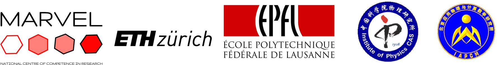

.. WannierTools documentation master file, created by
   sphinx-quickstart on Tue Nov  1 22:20:56 2016.
   You can adapt this file completely to your liking, but it should at least
   contain the root `toctree` directive.

WannierTools
============

**WannierTools: an open-source software package for novel topological materials**

Source on Github : https://github.com/quanshengwu/wannier_tools

Aiming to investigate topoligical properties of 

* Electron systems (Tested)

* Phonon systems (Testing)

.. toctree::
   :maxdepth: 2
   :numbered: 3

   changes
   preliminaries
   tutorials

**Citation**
^^^^^^^^^^^^

Please cite this paper when using WannierTools for your researchs::

   @article{WU2017,
   title = "WannierTools : An open-source software package for novel topological materials",
   journal = "Computer Physics Communications",
   volume = "224",
   pages = "405 - 416",
   year = "2018",
   issn = "0010-4655",
   doi = "https://doi.org/10.1016/j.cpc.2017.09.033",
   url = "http://www.sciencedirect.com/science/article/pii/S0010465517303442",
   author = "QuanSheng Wu and ShengNan Zhang and Hai-Feng Song and Matthias Troyer and Alexey A. Soluyanov",
   keywords = "Novel topological materials, Topological number, Surface state, Tight-binding model"
   }

**Correspondence**
^^^^^^^^^^^^^^^^^^^

Please report bugs to wuquansheng at gmail.com.

**Advertisement**
^^^^^^^^^^^^^^^^^^^

We already developed a tool to symmetrize Wannier tight binding models. It can symmetrize your wannier90_hr.dat which made of 
s, p, d and f orbitals. However, it is not released and under testing (The new version after May 10 2018 is more powerful and accurate).
If you want to use this part, plase contact one of our 
developers Changming Yue (yuechangming8 at gmail.com).  Before contacting him, please make sure that the Wannier functions you constructed should
are atomic-like orbitals. If you use random projectors in the Wannier90.win, we can't help you to symmetrize the Hamiltonian. 

.. image:: wannier_tools-logo-crop.png
   :scale: 20 %

**Sponsors**
^^^^^^^^^^^^^^^^^

This work was sponsored by the following institutes: 

